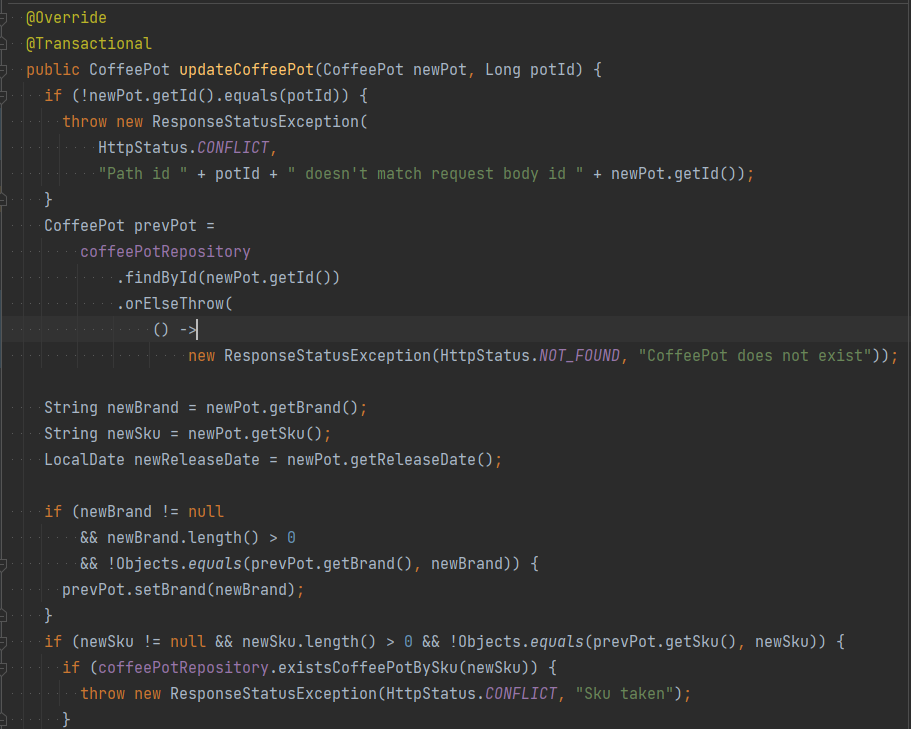
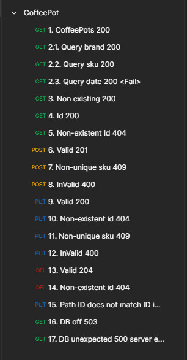

# Demo-simple-API

This is a small API for demonstration purposes.  
It's real simple and missing many features. See the [Requirements]() at the end for what is included.

Linted using Google style guid `ctrl+alt+L` ~~if you import the scheme, or `ctrl+shift+A` if you use
the plugin.~~

### Dependencies

[Open JDK 17](https://adoptopenjdk.net/releases.html) or
[JDK 17](https://www.oracle.com/java/technologies/java-se-glance.html)  
[postgres](https://www.postgresql.org/download/) This can only be run locally; there is no deployed
server.

- running on port 5432(default) using the coffeepot DB(you may need to create this DB unles you have
  a coffeepot DB you're not using anymore, lol *see bellow how to create the DB*)
- username: postgres
- password: root

## Getting Started

run $`mvn spring-boot:run` if your path is set, or navigate to
src/main/java/io.ex.../DemoCoffeePotServiceRestApplication.main()

[GET all coffee pots endpoint](http://localhost:8080/api/v1/coffeepot)  
[Swagger]()  
[Postman link](https://www.getpostman.com/collections/07ff5c91f154cbd702c6)  

### Testing

#### How to set up the coffee_pot DB in postgres

1. download [postgres](https://www.postgresql.org/download/)
2. $ `psql -U postgres`
3. if there's no coffeepot DB
    1. postgres=#`\l`
    2. then postgres=#`CREATE DATABASE coffeepot;`
    3. NOTE: if you ever forget the semicolon, just type the semicolon and press enter to run the
       command
4. postgres=# `GRANT ALL PRIVILEGES ON DATABASE "coffeepot" TO postgres;`
5. ensure the DB was created
    1. postgres=# `\c coffeepot`
    2. coffeepot=# `\d`
6. run DemoCoffeePotServiceRestApplication.main() to start this API
7. coffeepot=# `SELECT * FROM coffee_pot;`
8. Verify that you see many coffeepots

## Requirements:

1.
    -[x] Given a GET request is made to "/coffeepot", then all coffee pots are returned in a JSON
     array, and the status code is 200.
2.
    -[ ] Given a GET request is made to "/coffeepot?<some-query-here>", then all coffeepot that
     meet the query criteria are returned in a JSON array, and the status code is 200.
     Queryable fields include:

    1.
        -[x] brand
    2.
        -[x] sku
    3.
        -[ ] releaseDate
    4.
        -[ ] age
3.
    -[x] Given a GET request is made to "/coffeepot", and given no coffeepot exist, then an empty
     JSON array is returned, and the status code is 200.
4.
    -[x] Given a coffeepot exists, when a GET request is made to "/coffeepot/<that-coffeepot-id>",
     then
     that coffeepot is returned, with a status code of 200.
5.
    -[x] Given a GET request is made to "/coffeepot/<non-existent-id>", then an error
     response is returned with a status code of 404
6.
    -[x] Given a valid coffeepot has been provided in a JSON request body, when a POST
     request is made to "/coffeepot", then a coffeepot entity is stored in a database, and a
     JSON representation of the newly created coffeepot is returned, with a status code of 201.
7.
    -[x] Given a valid coffeepot has been provided in a JSON request body, and given that
     coffeepot's sku has been used already, when a POST request is made to
     "/coffeepot", then an error response is returned with a status code of 409.
8.
    -[x] Given an invalid coffeepot has been provided in a JSON request body, when a POST
     request is made to "/coffeepot", then an error response is returned with a status code
     of 400.
9.
    -[x] Given a coffeepot exists, and given that coffeepot's JSON representation has been altered
     and provided in a request body, when a PUT request is made to
     "/coffeepot/<that-coffeepot-id>", then the coffeepot is updated in the database, and a JSON
     representation of the newly updated coffeepot is returned, with a status code of 200.
10.
    -[x] Given a PUT request is made to "/coffeepot/<non-existent-id>", then an error
     response is returned with a status code of 404.
11.
    -[x] Given JSON of an existing coffeepot, and given the sku field has been updated to a
     different coffeepot's sku, when a PUT request is made to "/coffeepot/<that-coffeepot-id>",
     then an error response is returned with a status code of 409.
12.
    -[x] Given JSON of an existing coffeepot, and given updates have caused any field to
     become invalid, when a PUT request is made to "/coffeepot/<that-coffeepot-id>", an error
     response is returned with a status code of 400.
13.
    -[x] Given a coffeepot exists, when a DELETE request is made to "/coffeepot/<that-coffeepot-id>"
     ,
     then that coffeepot is deleted, and a status code of 204 is returned.
14.
    -[x] Given a DELETE request is made to "/coffeepot/<non-existent-id>", then a status code
     of 404 is returned.
15. Validation Requirements *All of the following fields are required, and have additional
    validation
    needs as specified*
    1.
        -[x] id must match id of path parameter (PUT only)
    2.
        -[x] brand
    3.
        -[x] sku must be in format XXXX-XXXXXXXX alpha numeric
    4.
        -[x] releaseDate

        1. **Non Functional Requirements:**
16.
    -[x] Given the database is not running, when a request is made to a registered
     endpoint, then an error response is returned with a status code of 503.
17.
    -[x] Given a request is made to a registered endpoint, when an unexpected server
     error occurs, then an error response is returned with a status code of 500. (test with server
     off, and get/id)
18.
    -[ ] Postman collection is created and provided as a link in the README. The
     postman collection demonstrates all of the 2XX and 4XX functional
     requirements.
19.
    -[ ] README includes a minimum of description, pre-requisites, usage, and testing
     sections.
20.
    -[ ] A valid .gitignore file is used, and ignored files do not exist in the remote
     repository.
21.
    -[ ] Google's Java coding standards are met and instructions on how to lint the
     project are included in the README.
22.
    -[ ] Java Docs style code comments are present on all public classes and methods.
23.
    -[ ] Unit tests cover at least 75% of any services (e.g. validation). Instructions for how
     to run the unit tests with code coverage are included in the README.
24.
    -[ ] Layered architecture is used for proper separation of concerns.
25.
    -[ ] Integration Testing covers payload, content type, and status code tests of all 2XX
     scenarios.
26.
    -[ ] Application logs any error scenarios to a file.
27.
    -[ ] Accurate swagger documentation is in place for all endpoints.

#### Nice to haves

1.
    - [ ] white label fallback

